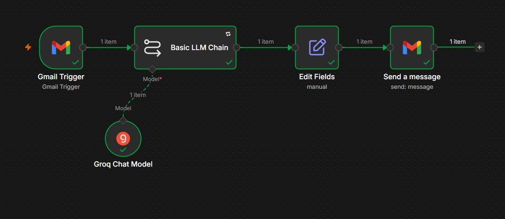
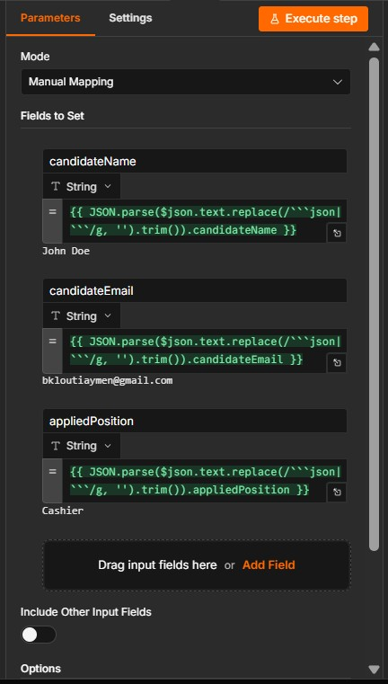

# AI-Powered HR Intake & Email Automation Pipeline

An event-driven, serverless automation pipeline built using **n8n** and **Groq Cloud API** to optimize corporate recruitment communication channels. This system automatically flags incoming candidate applications via Gmail, uses Large Language Models to extract structured entity variables from unstructured text, and triggers context-aware responses in sub-second execution speeds.

## Workflow Architecture Overview



The workflow consists of four critical infrastructure steps:
1. **Gmail Trigger (Webhook):** Monitors the inbox 24/7 for specific inbound application criteria.
2. **Basic LLM Chain + Groq Chat Model:** Offloads text heavy-lifting to cloud inference hardware (`llama-3.3-70b-versatile`), extracting core candidate identities.
3. **Edit Fields Node (Data Sanitization):** Utilizes regex parsing to strip markdown syntax wraps and isolate valid data objects.
4. **Gmail Reply Node:** Dynamically maps structured variables back into styled HTML candidate onboarding confirmations.

## Advanced Data Sanitization

Because cloud LLM providers often return JSON text wrapped inside markdown code fences (` ```json ... ``` `), a standard `JSON.parse()` operation will throw unexpected runtime failures. 

To overcome this, this architecture applies a strict regular expression parsing filter directly inside the data tokenization mapping stage to clean text streams before variable injection:



```javascript
// Sample implementation used to sanitize incoming token streams:
{{ JSON.parse($json.text.replace(/```json|```/g, '').trim()).candidateEmail }}
```
## How to Deploy & Run This Blueprint 
### Prerequisites:
- A local or cloud instance of n8n

- A free Groq Cloud API Key (from the Groq Developer Console)

- A Google Developer account with Gmail OAuth2 API credentials enabled

### Installation Steps:

1- Download the hr-recruitment-automation.json file from this repository root.

2- Open your n8n workspace dashboard, click the top-right options menu (...), and select Import from file....

3- Select the downloaded JSON blueprint to populate the node canvas.

4- Open the Groq Chat Model node, click Create New Credential, and paste your API key.

5- Re-authenticate your Gmail Trigger and Send a message nodes with your OAuth credentials.

6- Toggle the workflow to Active to let it listen for inbound applicant requests in real-time.

